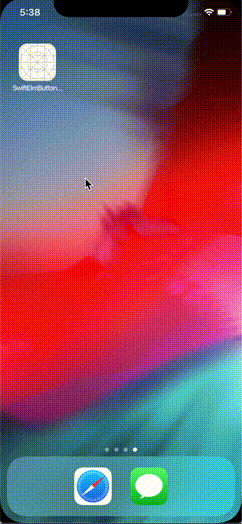

# The Elm Architecture sample v2 implemented with Swift

This includes `Command` and `Subscription` which are excluded for simplicity in [v1](https://github.com/yoching/SwiftElmButtonSample).


## Differences from [v1](https://github.com/yoching/SwiftElmButtonSample)

- elements
  - add `Command`
  - add `Subscription`
- behavior
  - save current value into UserDefaults using `Command`
  - load stored value in UserDefaults
  - save & load are also done when the app enters background and foreground respectively using `Subscription`

`Command` is a way to declare side-effects (networking, storage, ...), and `Subscription` is a way to subscribe outer changes (like notifications).  
Please read [here](https://guide.elm-lang.org/effects/) for the details.



## AppState
```swift
struct AppState {

    // MODEL
    var value: Int

    // UPDATE
    enum Message {
        case increment
        case decrement
        case save
        case load
        case loaded(Int)
    }

    mutating func update(_ message: Message) -> [Command<Message>] {
        switch message {
        case .increment:
            value = value + 1
            return []
        case .decrement:
            value = value - 1
            return []
        case .save:
            return [.save(value: value)]
        case .load:
            return [.load(available: { .loaded($0) })]
        case .loaded(let value):
            self.value = value
            return []
        }
    }

    // SUBSCRIPTIONS
    var subscriptions: [Subscription<Message>] {
        return [
            .notification(
                name: UIApplication.didBecomeActiveNotification,
                { notification -> Message in
                    return .load
            }),
            .notification(
                name: UIApplication.willResignActiveNotification,
                { notification -> Message in
                    return .save
            })
        ]
    }

    // VIEW
    var viewController: ViewController<Message> {
        return ._viewController(
            .stackView(
                views: [
                    .button(text: "-", onTap: .decrement),
                    .label(text: "\(value)"),
                    .button(text: "+", onTap: .increment),
                    .button(text: "save", onTap: .save),
                    .button(text: "load", onTap: .load)
                ],
                axis: .vertical,
                distribution: .fillEqually
            )
        )
    }
}
```


## References
- [1st version](https://github.com/yoching/SwiftElmButtonSample)
- App Architecture from objc.io
  - [book & video](https://www.objc.io/books/app-architecture/)
  - [sample codes](https://github.com/objcio/app-architecture)
    - especially, Recordings-TEA & One-App-Eight-Architectures
